# Robust Mini-Batch Gradient Descent

## Introduction

This repository contains the source codes and test results for the final project of COMP_SCI 496: Foundations of Reliability and Robustness in Machine Learning at Northwestern University.

Mini-Batch Gradient Descent (MBGD) is a simple yet effective machine learning model as a linear (and polynomial) regressor. However, the naïve MBGD model with squared losses is very sensitive to outliers, making it vulnerable to adversary samples.

Our group is proposing to add a trimming procedure based on the losses when calculating the gradients to make the MBGD model more robust. We will measure the robustness of the modified model under the ε-contamination model by calculating the mean squared error (MSE) on the testing sets (without noise nor contamination).

We will test with different patterns of contamination. See the test results section for details.

## Algorithm

    Procedure fit:
        Initialize w
        While not converged and not exceeding max_iter iterations:
            Randomly select batch_size samples without replacement
            Calculate the losses of all the samples in the batch
            Calculate the gradient of the losses with respect to w, ignoring the effects of the ε ⋅ batch_size samples with the largest losses
            Update w

## Run Tests

```
python3 -m venv venv
source venv/bin/activate
pip3 install -r requirements.txt
python3 -m tests
```

## Procedures to Add More Test(s)

1. Create a new file under `tests/`

2. Define a/some function(s) performing the new test(s) in the newly created file

3. Import the newly created file in `tests/__main__.py`

4. Call the newly defined function(s) in `tests/__main__.py`

## Test Results

| Condition | Training Set (robust) | Testing Set (robust) | Training Set (naïve) | Testing Set (naïve) |
| - | - | - | - | - |
| no noise no contamination |  |  | 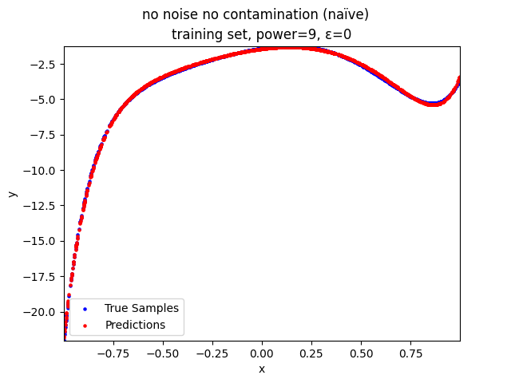 | 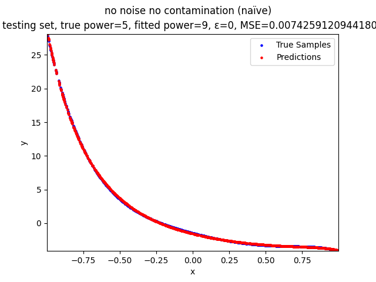 |
| no contamination |  |  | 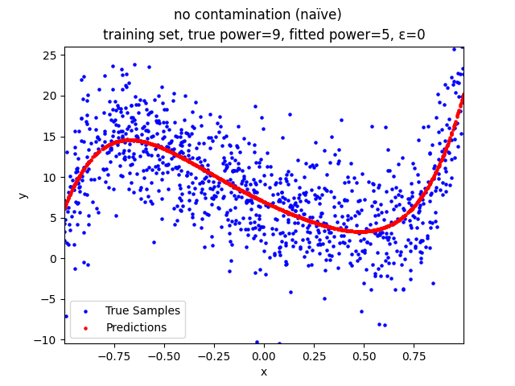 | 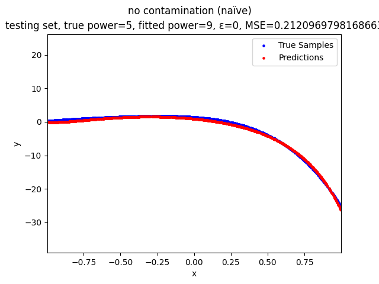 |
| random contamination |  |  |  |  |
| parallel line contamination |  |  |  |  |
| edge contamination |  |  | 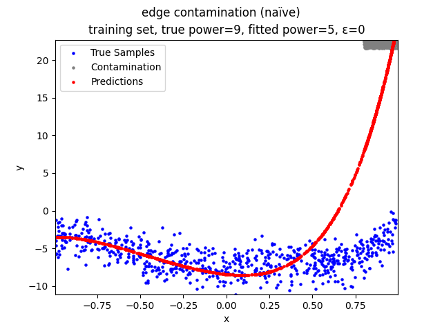 | 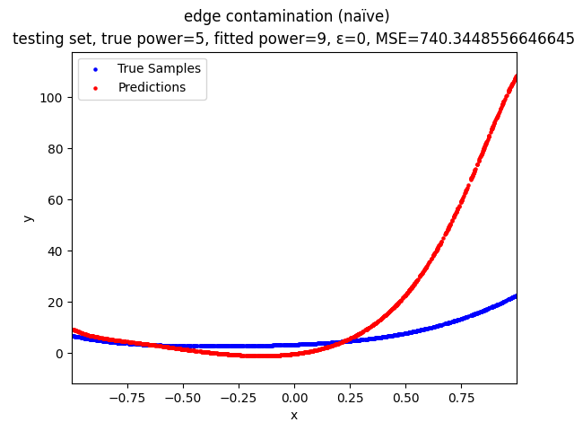 |
| begin contamination |  |  | 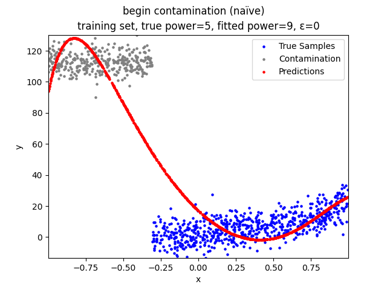 | 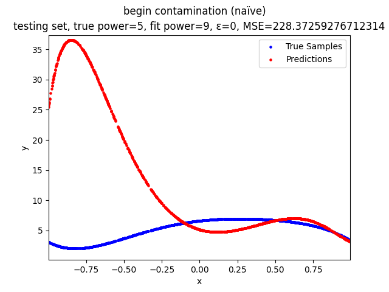 |
| end contamination |  |  | 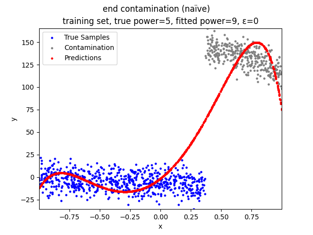 |  |
| mid contamination |  |  | 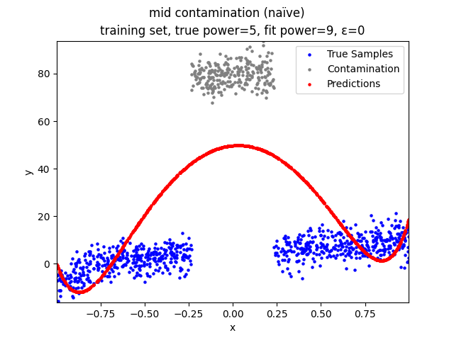 | 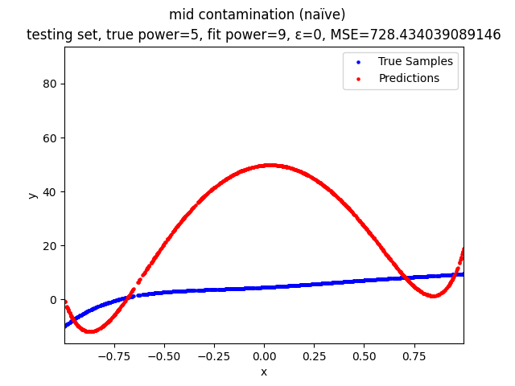 |
| mid rand contamination | 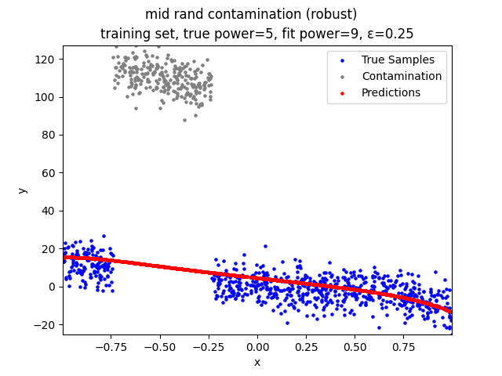 | 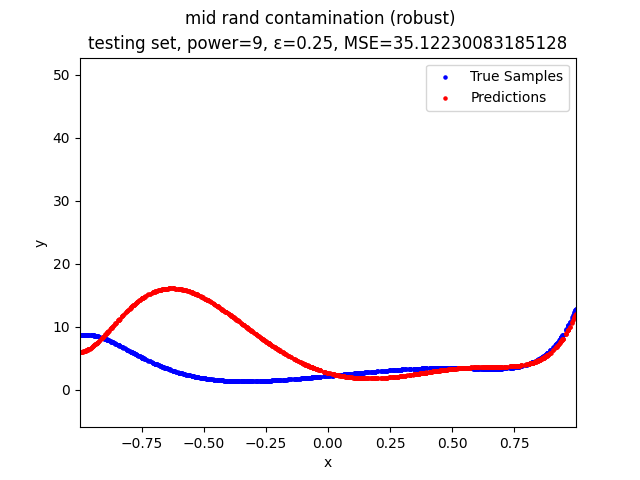 | 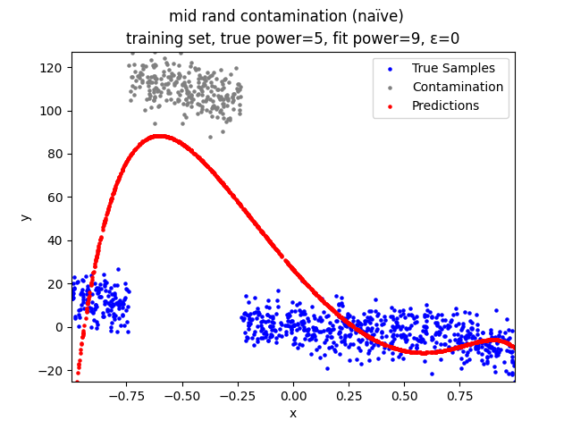 |  |

## TODO

- Implement L1 regularization, absolute loss, and huber loss. Remove deprecated `main.py`

- Implement the convolutional pre-processing step

- Test the cases where a specific range of true samples are replaced by adversary contamination

- Find the failure boundaries of the model under different types of contamination

- Test whether the model still works when the fitted power is not equal to the true power

- Finish the final report and add it to the repo

## Contribution

[Hanming Wang](https://github.com/WHMHammer)

- Proposed the trimming step as a modification to the naive MBGD model

- Proposed the convolutional pre-processing step

- Implemented all parts of the modified MBGD model, except for the Huber loss

- Implemented the polynomial regression model and its helper functions

- Implemented the helper functions for the tests

- Implemented the following tests:

    - no noise no contamination

    - no contamination

    - random contamination

    - parallel line contamination

- Wrote the README

- Contributed to the group meetings

[Robin Luo](https://github.com/robinzixuan)

- Implemented the Huber loss

- Implemented the following tests:

    - edge contamination

    - begin contamination

    - end contamination

    - mid contamination

    - mid rand contamination

- Wrote the following parts of the final report:

    - Abstract

    - Introduction

    - Related works

    - References

- Contributed to the group meetings

[Yue Wang](https://github.com/glazialuna)

- Contributed to the group meetings
