# Robust Mini-Batch Gradient Descent

## Introduction

This repository contains the source codes and test results for the final project of COMP_SCI 496: Foundations of Reliability and Robustness in Machine Learning at Northwestern University.

Mini-Batch Gradient Descent (MBGD) is a simple yet effective machine learning model as a linear (and polynomial) regressor. However, the naive MBGD model with squared losses is very sensitive to outliers, making it vulnerable to adversary samples.

Our group is proposing to add a trimming procedure based on the losses when calculating the gradients to make the MBGD model more robust. We will measure the robustness of the modified model under the ε-contamination model by calculating the mean squared error (MSE) on the testing sets (without noise nor contamination).

We will test with different patterns of contamination. See the test results section for details.

## Algorithm

    Procedure kernel_preprocessing:
        For all samples:
            calculate the lowest and highest indices of the kernels that include the sample
        For all kernels:
            combine the samples within the kernel, if and only if the number of samples is larger than the threshold
        Return the combined samples only

    Procedure fit:
        Initialize w
        While not converged and not exceeding max_iter iterations:
            Randomly select batch_size samples without replacement
            Calculate the losses of all the samples in the batch
            Calculate the gradient of the losses with respect to w, ignoring the effects of the ε ⋅ batch_size samples with the largest losses
            Update w

## Run Tests

```
python3 -m venv venv
source venv/bin/activate
pip3 install -r requirements.txt
python3 -m tests
```

## Procedures to Add More Test(s)

1. Create a new file under `tests/`

2. Define a/some function(s) performing the new test(s) in the newly created file

3. Import the newly created file in `tests/__main__.py`

4. Call the newly defined function(s) in `tests/__main__.py`

## Test Results

| Condition | Training Set (robust) | Testing Set (robust) | Training Set (naive) | Testing Set (naive) |
| - | - | - | - | - |
| no noise no contamination | 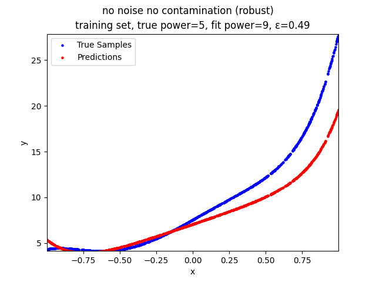 | 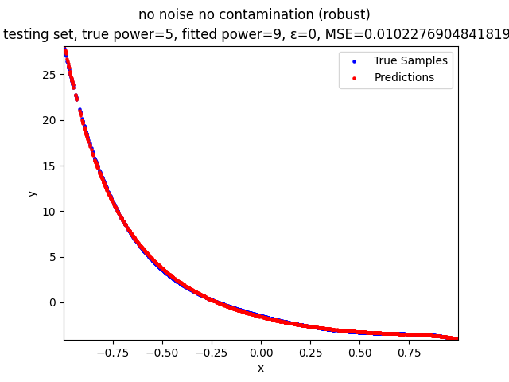 | 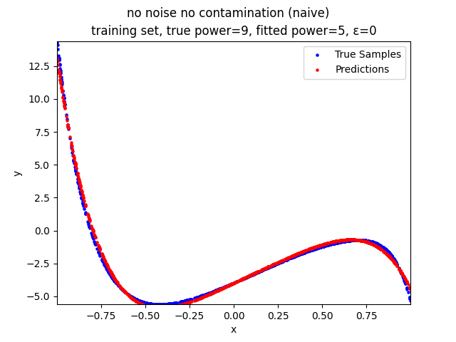 | 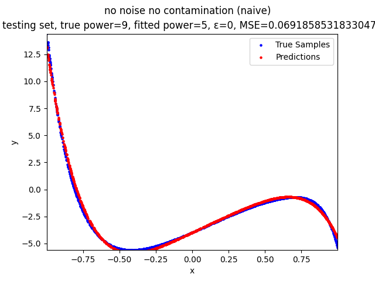 |
| no contamination | 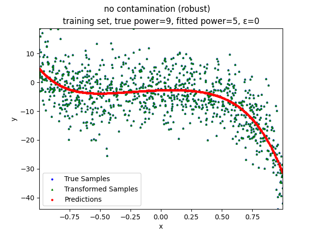 | 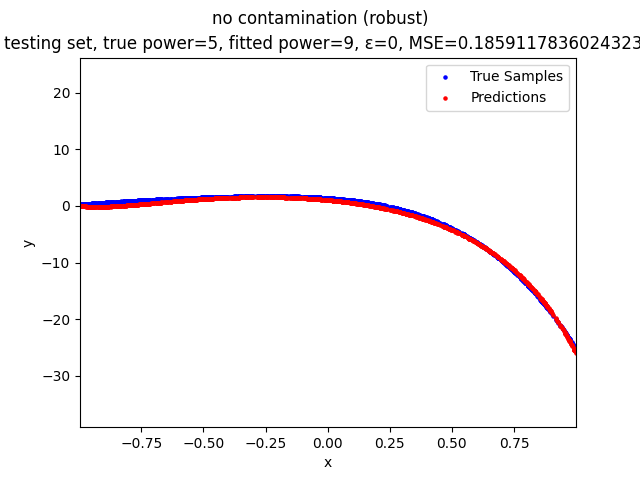 | 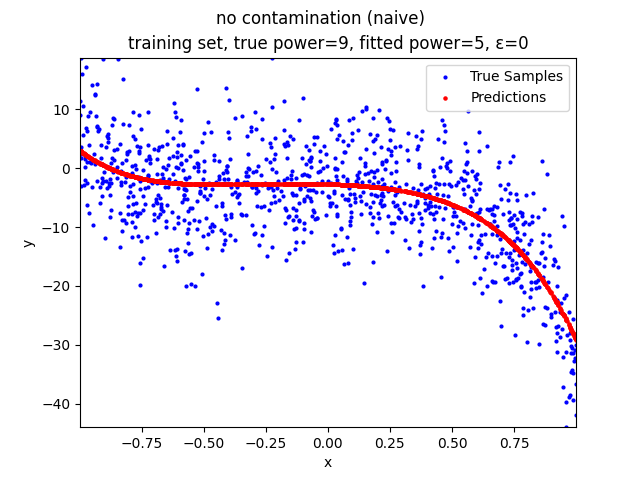 | 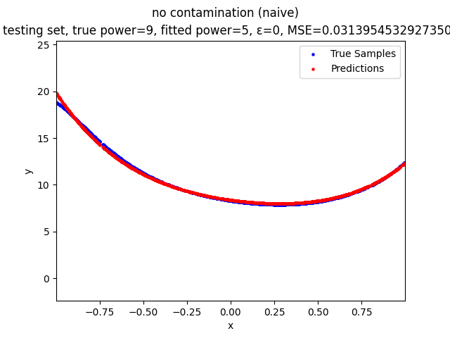 |
| random contamination | 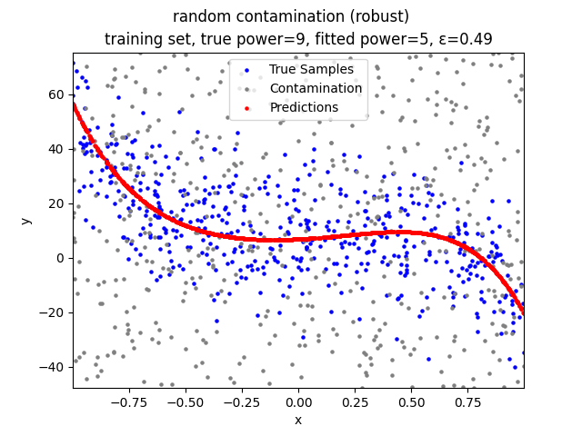 | 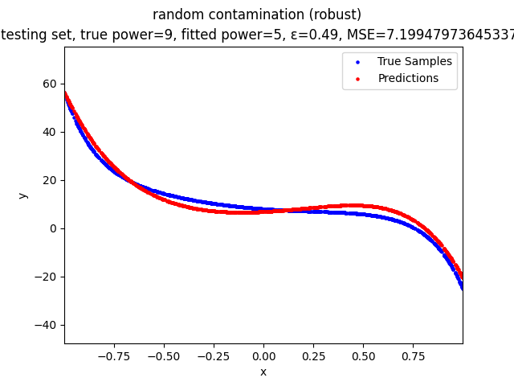 | 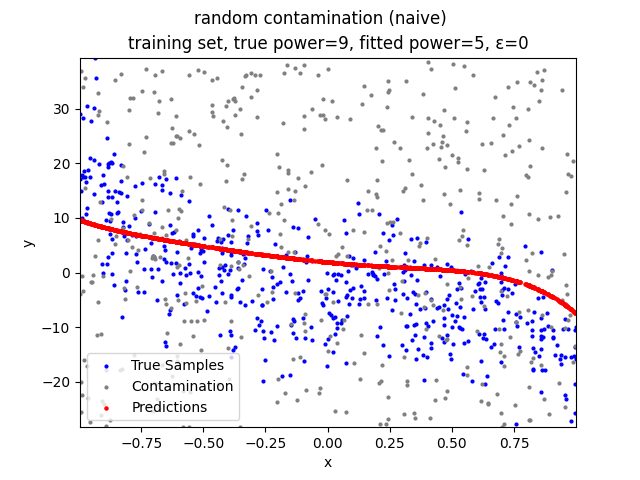 | 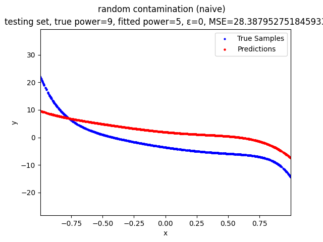 |
| parallel line contamination | 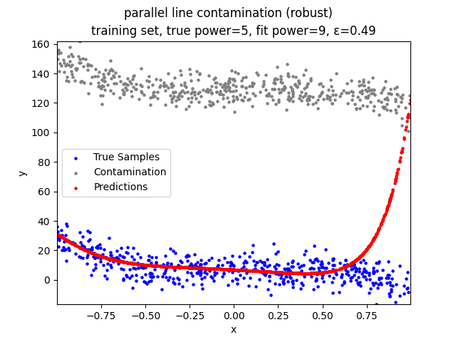 | 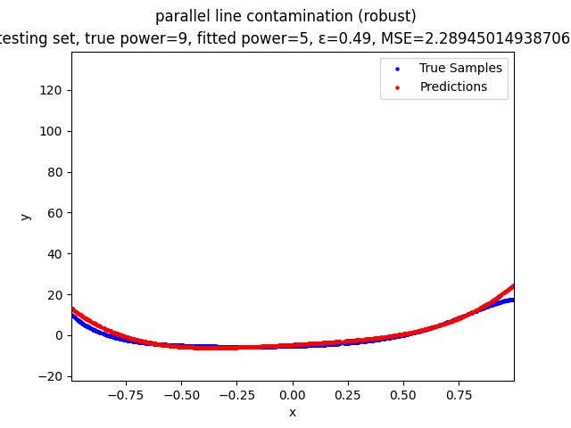 | 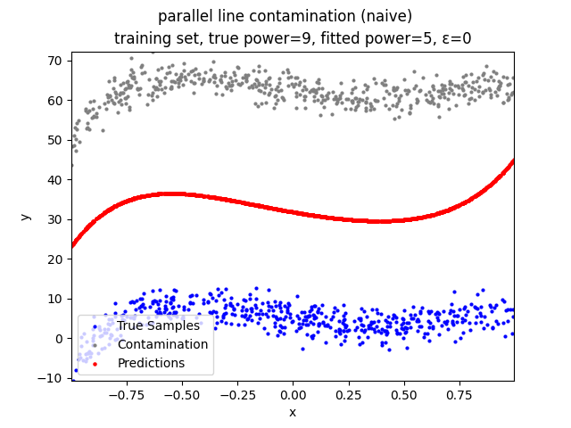 | 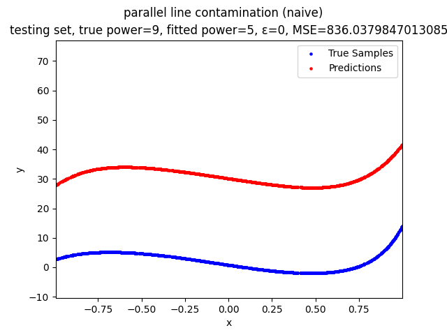 |
| edge contamination | 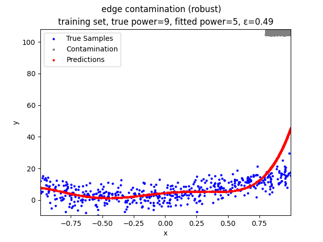 | 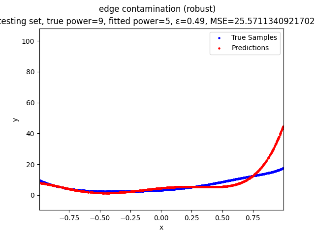 | 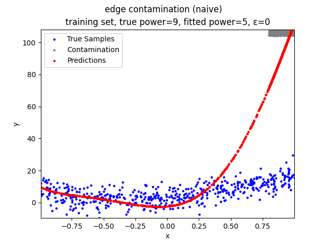 | 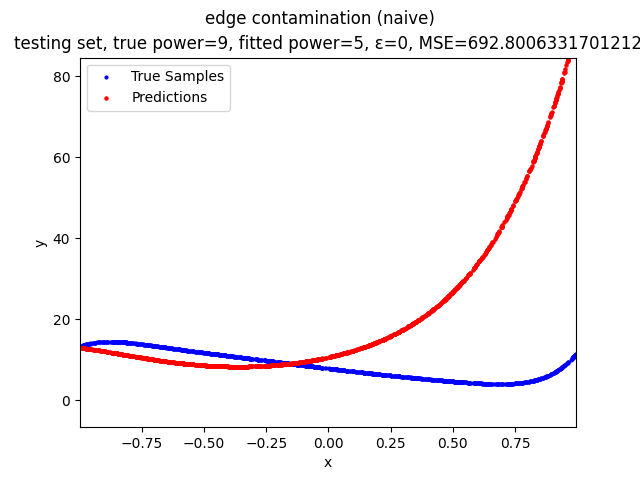 |
| begin contamination | 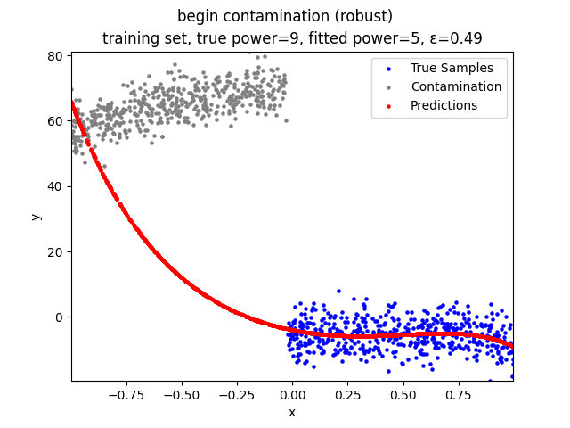 | 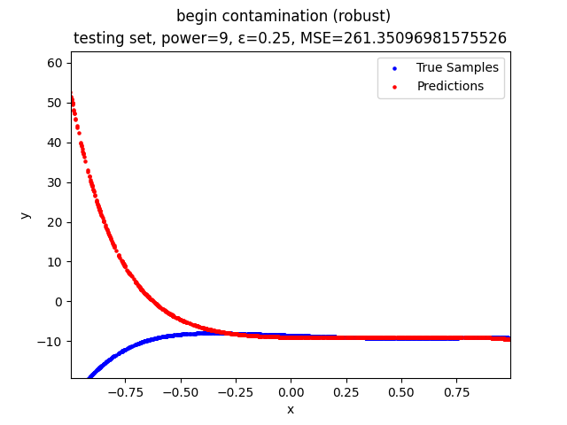 | 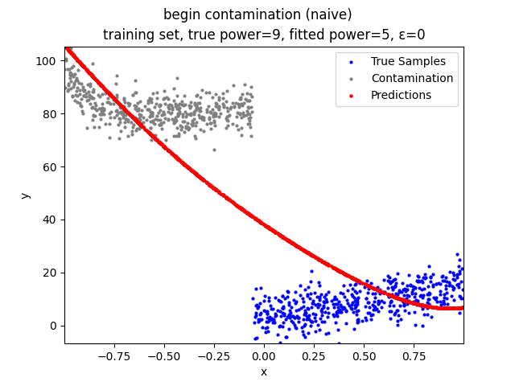 | 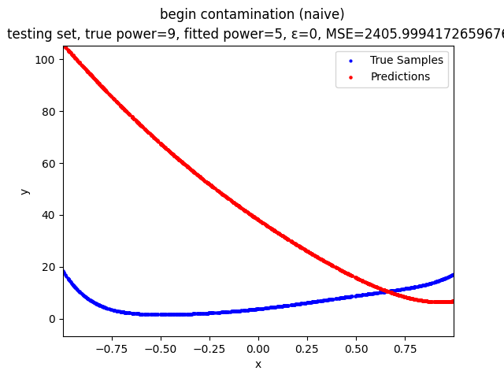 |
| end contamination | 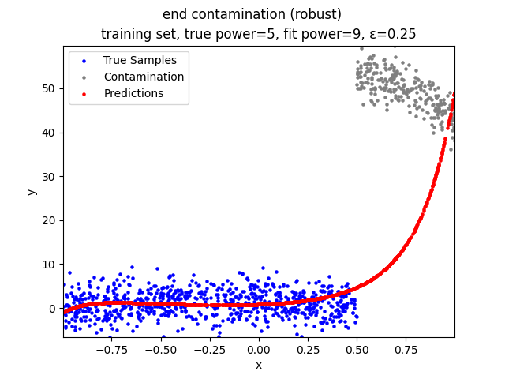 | 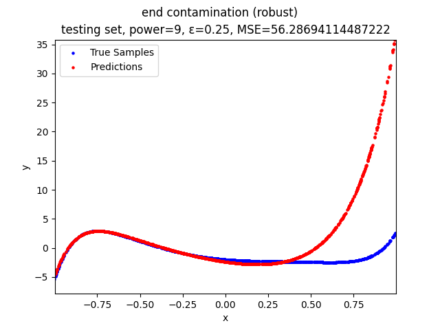 | 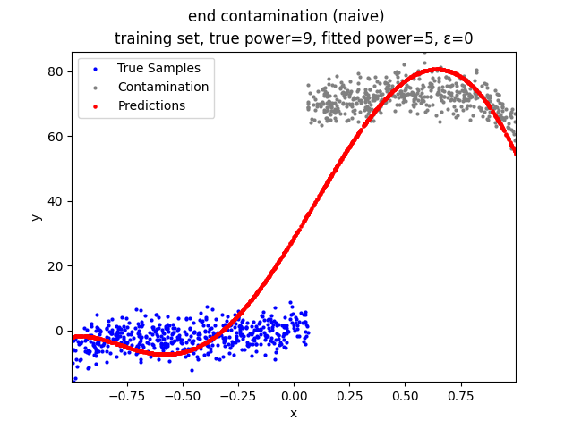 | 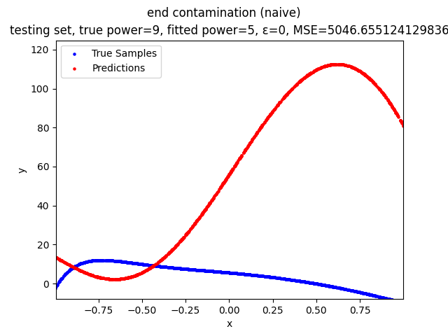 |
| mid contamination | 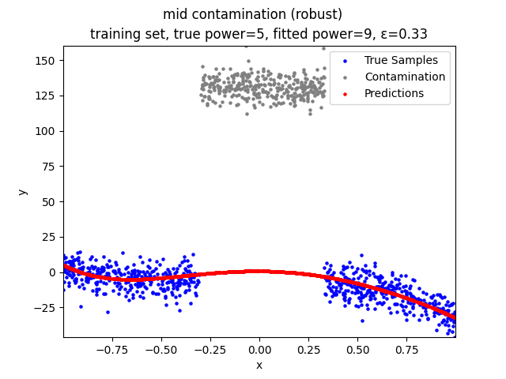 | 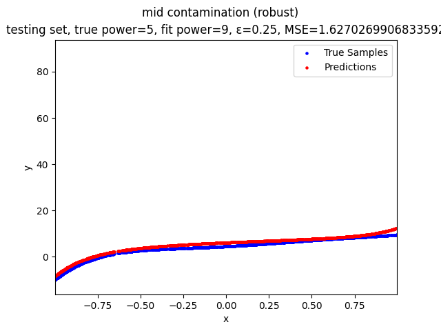 | 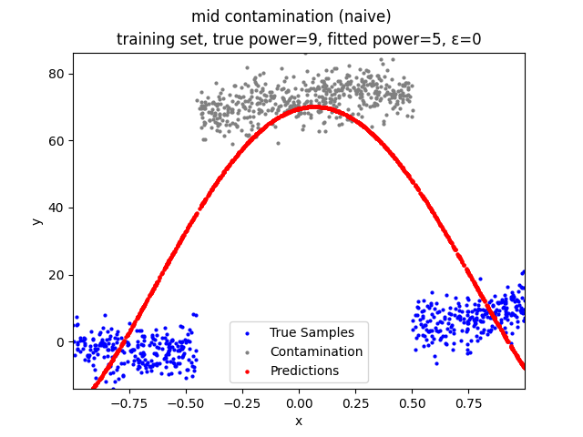 |  |

## TODO

- Implement the geometric median kernel preprocessor

- Tune and test the kernel preprocessors

- Modify the helper function(s) for the tests to export the following figures:

    - For the models with kernel preprocessing and trimming:

        - Predictions over the original training set

        - Predictions over the preprocessed training set

        - Predictions over the testing set

    - For the models with trimming only:

        - Predictions over the training set

        - Predictions over the testing set

    - For the models with kernel preprocessing only:

        - Predictions over the original training set

        - Predictions over the preprocessed training set

        - Predictions over the testing set

    - For the naive models:

        - Predictions over the training set

        - Predictions over the testing set

- Find the failure boundaries of the polynomial regression models under different types of contamination

- Finish the final report and add it to the repo

## Future Works

- Theoretically prove the robustness of the model

- Test whether the model scales

## Contribution

[Hanming Wang](https://github.com/WHMHammer)

- Proposed the trimming step as a modification to the naive MBGD model

- Proposed the kernel preprocessor

- Implemented all parts of the modified MBGD model, except for the Huber loss (forward loss)

- Implemented the kernel preprocessor

- Implemented the polynomial regression model and related helper functions

- Implemented the helper functions for the tests

- Tested the following contamination families:

    - no contamination

    - random contamination

    - parallel line contamination

- Wrote the README

[Robin Luo](https://github.com/robinzixuan)

- Implemented the Huber loss (forward loss)

- Tested the following contamination family:

    - edge contamination

- Wrote the following parts of the final report:

    - Abstract

    - Introduction

    - Related works

    - References

[Yue Wang](https://github.com/glazialuna)

- Proposed the clustering preprocessor

- Implemented the clustering preprocessor

- Tested on the following relations between MSE and contamination properties:

    - MSE vs. contamination distance

    - MSE vs. contamination density

    - MSE vs. epsilon
