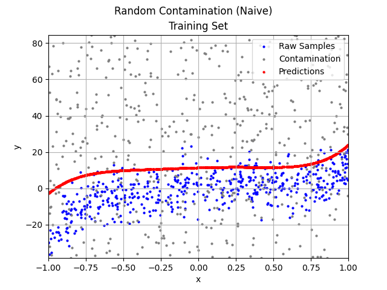
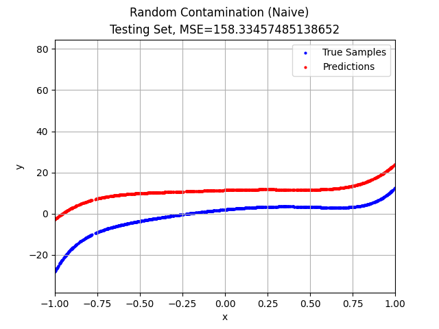
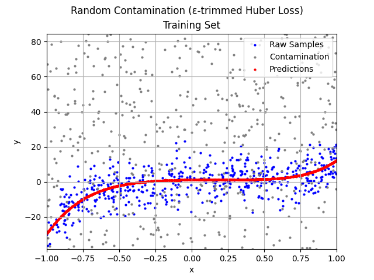
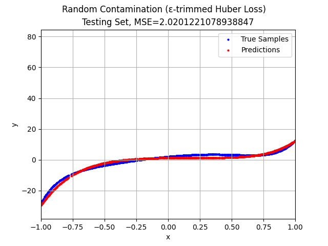

# Robust Mini-Batch Gradient Descent

This repository is a fork and extension of [496-final-project](https://github.com/WHMHammer/496-final-project). All work beyond the original project is done solely by myself.

## Introduction

Mini-Batch Gradient Descent (MBGD) is a simple yet effective machine learning model as a multiple linear (and thus, polynomial) regressor. However, the naive MBGD model with squared losses is very sensitive to outliers, making it vulnerable to adversary contamination in the training sets.

We introduced several modifications to the naive MBGD model, making it more robust:

- Huber loss instead of squared loss. Huber loss reduces the influences of the samples far away from the fitted line.

- ε-trimming. Our assumption of the contamination is the Huber's ε-contamination model, where an arbitrary ε ∈ [0, 1) arbitrary proportion of the true samples are replaced by arbitrary adversary samples. The ε-trimming step we introduced trimmes the ε · batch_size samples with the largest absolute residuals in every batch, so they will not be parts of the gradients calculated and will not affect the updated weights.

    The motivation is: If the adversary samples are close to the fitted line, they don't really matter. If the adversary samples are far away from the fitted line, they are likely to have larger absolute residuals than the true samples, and thus be trimmed.

- Kernel proprocessing. Our kernel preprocessor is inspired by the kernels in Neural Networks. We scan the input space with kernels, and combine the samples captured by each kernel, if and only if there are "enough" samples captured. We will then train the MBGD model with the output samples of the kernel preprocessor.

    The parameters of the kernel preprocessors are kernel size, strides, and threshold (a proportion of the training sample size). The padding is fixed to be the same as the kernel size.

## Run Tests

```
python3 -m venv venv
source venv/bin/activate
pip3 install wheel
pip3 install -r requirements.txt
python3 -m tests
```

## Test Results

For all the tests, we were fitting on 9-degree polinomials (with 10 mutually independent weights, including the bias term) with noise ~ 𝒩(0, Var(y)) and ε = 0.49.

| Test Name | Naive Training | Naive Testing | ε-trimmed Huber Loss Training | ε-trimmed Huber Loss Testing |
| - | - | - | - | - | 
| Random Contamination |  |  |  |  |
